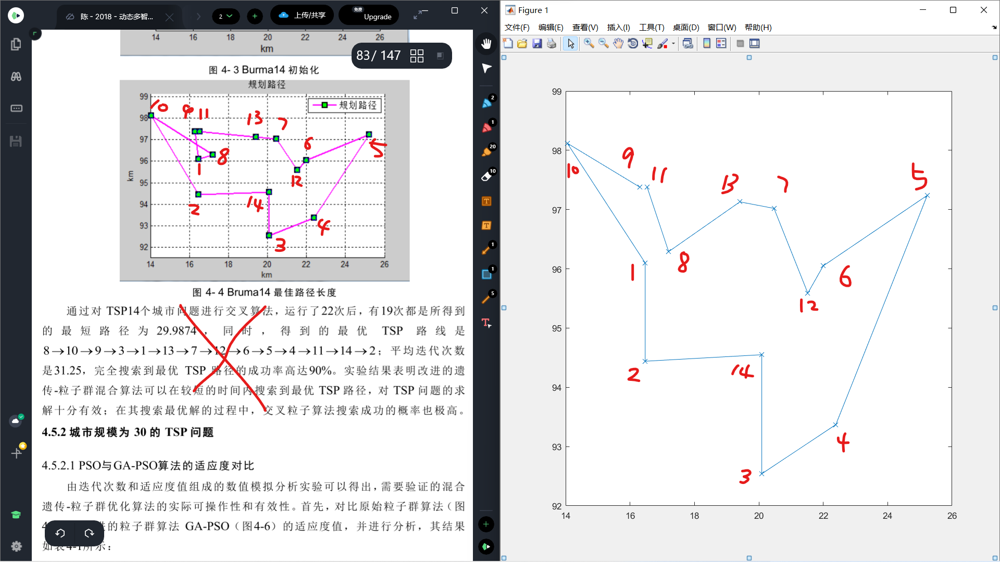

# 声明

这些代码是陈克明(2018)[1]中第四章算法的重现。注意并非源代码，仅是按照论文中思路的代码重现。

作者：宋世超

邮箱：Ki_Seki@outlook.com

# 使用方法

1. 在 http://comopt.ifi.uni-heidelberg.de/software/TSPLIB95/tsp/ 下载合适的数据集
2. 修改 main.m 开始的参数部分
3. 运行 main.m 即可

# 文件结构

* main.m 是主文件，运行其会调用 TSP 数据和函数文件
* 以 .tsp 结尾的文件是数据集，来源：http://comopt.ifi.uni-heidelberg.de/software/TSPLIB95/tsp/
* readTsp() 用于读取上述来源的数据集
* fitness() 用于计算适应度
* crossover() 用于进行论文中说的交叉操作
* mutation() 用于进行论文中说的变异操作
* drawPath()  用于绘制一条 TSP 回路

# 实验重现

在 4.5 仿真实验中，结果是有误的。

我对第一个数据集 burma14 做了实验复刻，发现：

其计算出的路径为 `[8 10 9 3 1 13 7 12 6 5 4 11 14 12]`，其的适应度不是 29.9874，而是 49.8914

我计算出的路径为 `[3 4 5 6 12 7 13 8 11 9 10 1 2 14]`，其适应度为 30.8785

以下分别是作者提供的路径图（左）和我的路径图（右）

可以发现其图片的绘制也是有问题的。

对于文件夹中的另外两个数据集，st70 和 ch150，容易验证也有相似的问题。

# 参考文献

[1]陈克明. 动态多智能算法及其在物流配送系统中的应用研究[D/OL]. 东华大学, 2018.https://kns.cnki.net/KCMS/detail/detail.aspx?dbcode=CDFD&dbname=CDFDLAST2019&filename=1018995735.nh&v=.